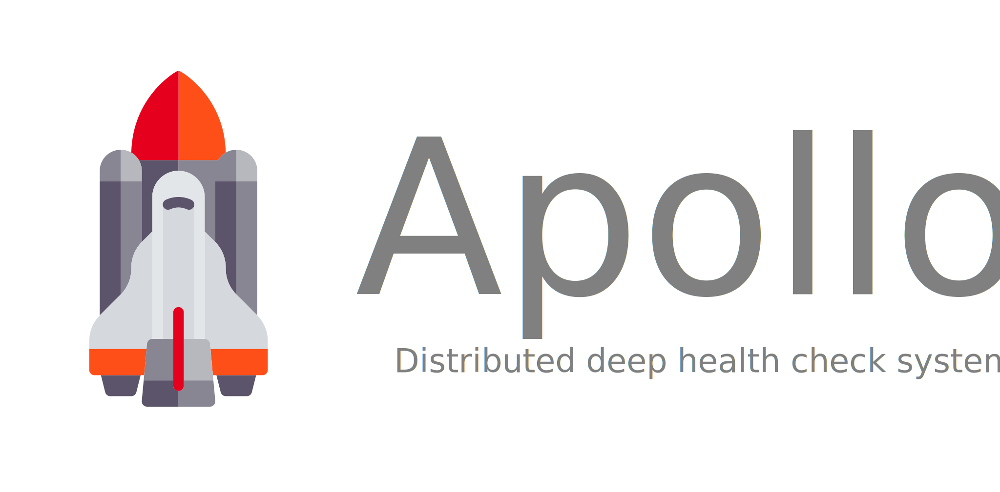

  

---

# Apollo

Apollo is a distributed deep health check system.

A typical health check service usually checks whether a given service is up or not by using a simple HTTP ping on a pre-configured service endpoint.

Apollo goes one step further by asking the service to report the health of its dependencies that are necessary for the application to work optimally.

## How does it work?

Apollo has two parts:
- The Apollo server
- Apollo SDKs

Apollo server is a standalone server which helps in:
- Registering services
- Triggering health checks

Apollo SDKs will be integrated into the source code of the application to be monitored.
